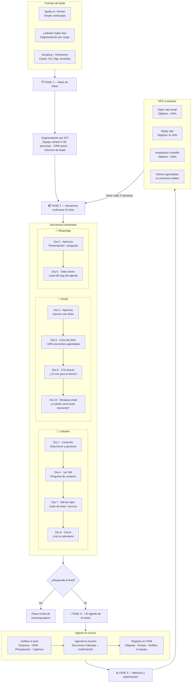

# Estrategia Outbound — Agente de IA de Ventas

## Cronograma de 10 días

```mermaid
gantt
    title Secuencia de contacto por canal
    dateFormat  D
    axisFormat Día %d

    section LinkedIn
    Solicitud de conexión        :li1, 1, 1d
    1er DM — pregunta contexto   :li2, 4, 1d
    DM de valor / caso de éxito  :li3, 7, 1d
    Cierre — link calendario     :li4, 9, 1d

    section Email
    Apertura — gancho con dolor  :em1, 3, 1d
    Caso de éxito                :em2, 5, 1d
    CTA directo — pedir demo     :em3, 8, 1d
    Breakup email                :em4, 10, 1d

    section WhatsApp
    Apertura — presentación      :wa1, 2, 1d
    Video demo Loom 60 seg       :wa2, 6, 1d
```

## Notas de implementación

- **LinkedIn primero**: el warm-up (seguir + comentar posts) se hace *antes* del Día 1 para generar familiaridad
- **Nota de conexión**: corta y personal, sin mencionar el producto todavía
- **WhatsApp**: solo si se tiene el número · máximo 2 mensajes no solicitados
- **Cuando responde**: el agente de IA toma el control de la conversación, califica, agenda y registra en CRM automáticamente
- **Iteración**: revisar métricas cada 2 semanas y ajustar asuntos, ganchos y CTAs
